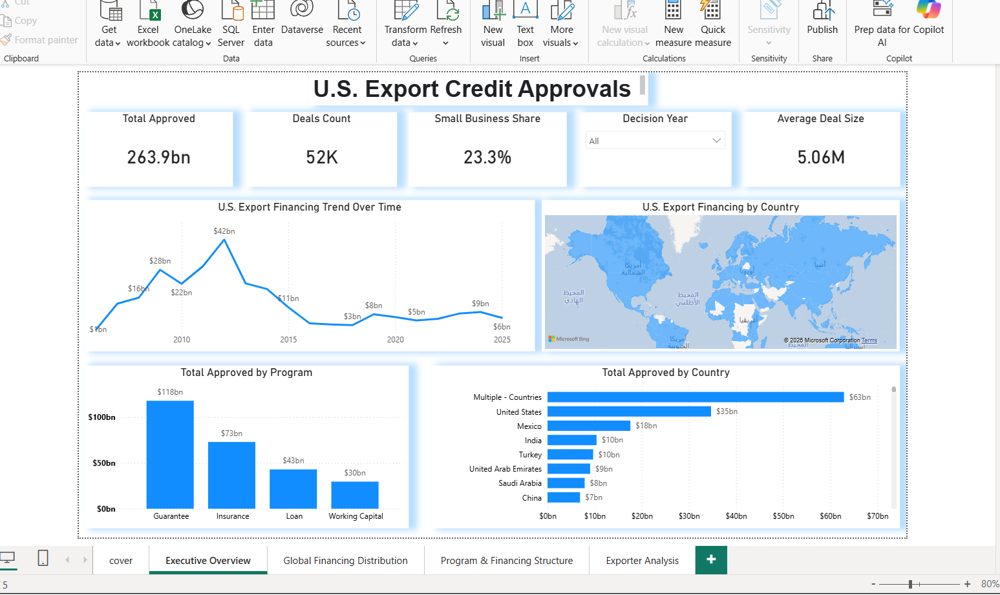
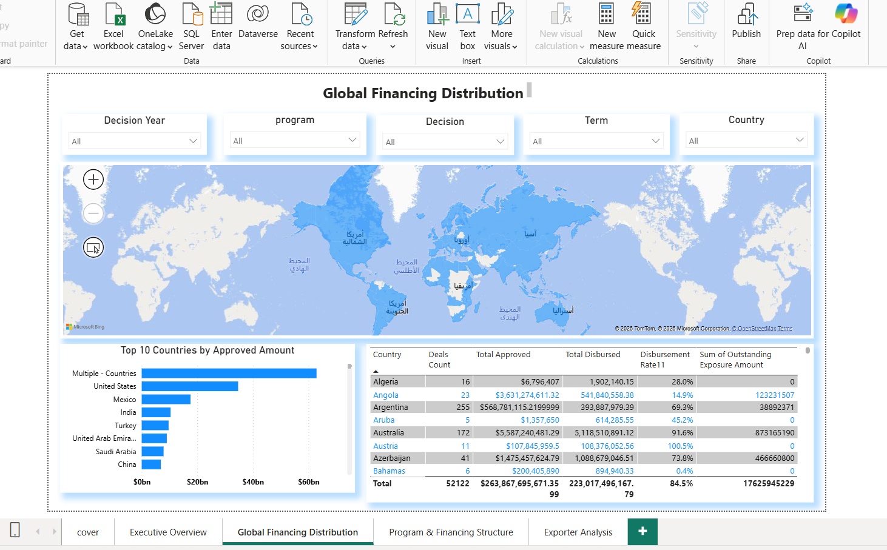
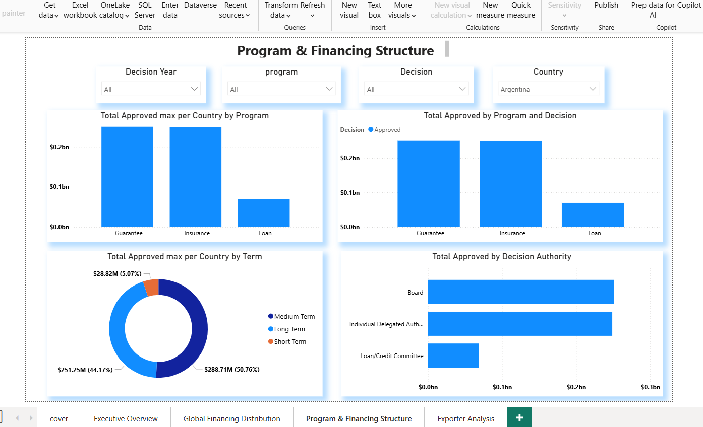
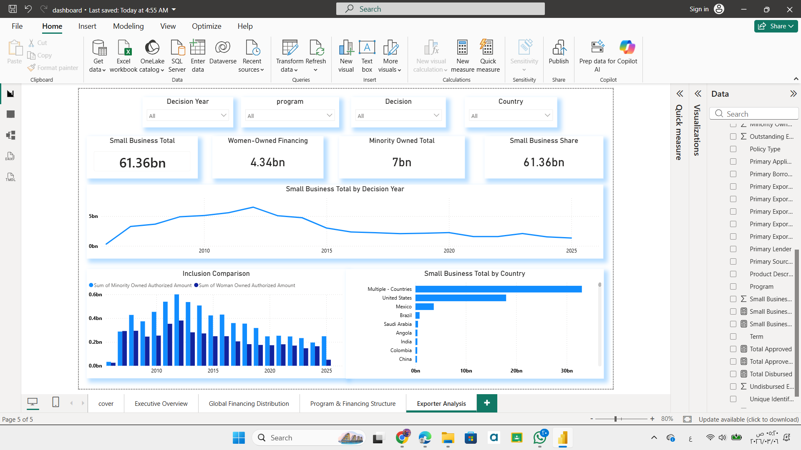

# U.S. Export Financing Analysis

## Project Overview
This project analyzes U.S. Export Credit financing approvals to understand global financing distribution, exporter participation, and program structures.

The analysis was built using Power BI to generate business insights from export financing data.

---

## Tools Used

- Power BI
- Excel
- Data Analysis
- Business Intelligence

---

## Dataset

The dataset includes:

- Fiscal Year
- Country
- Exporter
- Program Type
- Financing Amount
- Decision Status
- Policy Type
- NAICS Code

Total records: **20,000+**

---

# Dashboard Preview

## Executive Overview

---

## Global Financing Distribution

---

## Program & Financing Structure

---

## Exporter Analysis

---

# Key Business Insights

- Export financing approvals are highly concentrated among a limited number of countries.
- Long-term financing programs account for the largest share of total financing volume.
- A small group of exporters dominate approval amounts.
- Financing approvals show clear patterns across fiscal years.

---

# Project Structure

US-Export-Financing-Analysis
│
├── data
│   └── export_financing_cleaned.csv
│
├── dashboard
│   └── dashboard.pbix
│
├── images
│
├── docs
